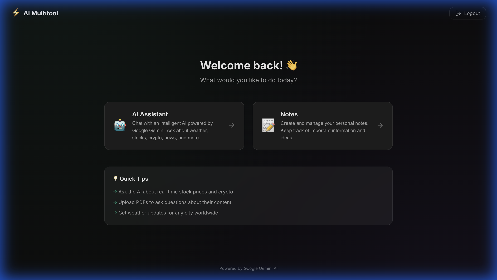
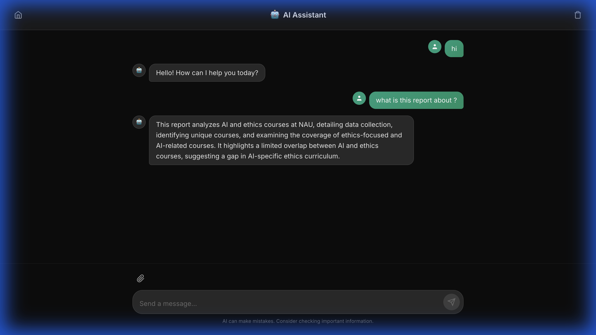
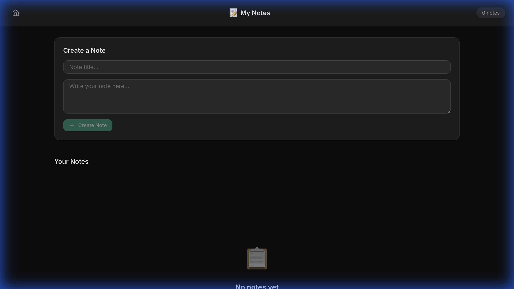
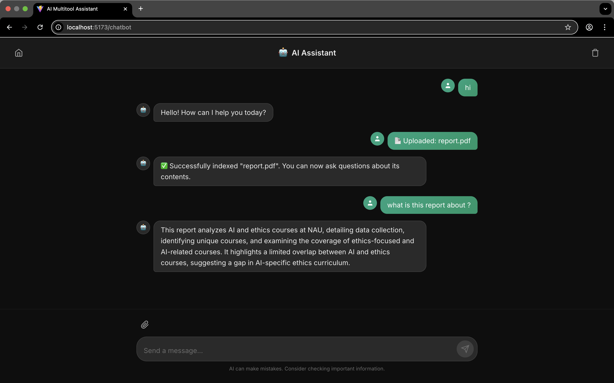

# 🧠 AI Multitool Assistant

A full-stack AI-powered web assistant with a modern dark theme interface, featuring PDF Q&A, real-time data tools, and notes management.



## ✨ Features

- 🤖 **AI Chat** — Chat with a ReAct agent powered by Google Gemini
- 📄 **PDF Q&A** — Upload PDFs and query their contents
- 📈 **Real-time Data** — Stock prices, crypto, weather, and news
- 📝 **Notes** — Create, view, and delete personal notes
- 🔐 **Auth** — Secure JWT-based user accounts

## 🎨 Screenshots

| Login | Chatbot | Notes |
|-------|---------|-------|
|  |  |  |

### PDF Indexing


## 🛠️ Tech Stack

| Layer | Technologies |
|-------|-------------|
| **Frontend** | React, Vite, Axios |
| **Backend** | Django, Django REST Framework |
| **AI** | Google Gemini via LlamaIndex |
| **Embeddings** | HuggingFace (BAAI/bge-small-en-v1.5) |
| **Auth** | JWT (djangorestframework-simplejwt) |

---

## 🚀 Quick Start

### Prerequisites
- Python 3.10+
- Node.js 18+
- [Google AI API key](https://makersuite.google.com/app/apikey)

### 1. Clone & Setup Environment

```bash
git clone https://github.com/kalebcoleman/ai-multitool-assistant.git
cd ai-multitool-assistant

# Create conda environment (recommended)
conda create -n ai-assistant python=3.12
conda activate ai-assistant
```

### 2. Backend Setup

```bash
cd backend
pip install -r requirements.txt
```

Create `backend/.env`:
```env
GOOGLE_API_KEY=your_google_api_key
GOOGLE_GENAI_MODEL=gemini-2.5-flash   # optional, defaults to gemini-2.5-flash
SECRET_KEY=your_django_secret_key
ALPHA_VANTAGE_API_KEY=your_key        # optional, for stock data
OPENWEATHERMAP_API_KEY=your_key       # optional, for weather
NEWS_API_KEY=your_key                 # optional, for news
```

Run migrations:
```bash
python manage.py migrate
```

### 3. Frontend Setup

```bash
cd ../frontend
npm install
```

---

## 🏃 Running the App

**Terminal 1 — Backend:**
```bash
cd backend
python manage.py runserver
# → http://127.0.0.1:8000
```

**Terminal 2 — Frontend:**
```bash
cd frontend
npm run dev
# → http://localhost:5173
```

Open http://localhost:5173 in your browser.

---

## 🤖 AI Agent Tools

| Tool | Example Prompt |
|------|---------------|
| 📈 **Stocks** | "What is the latest price of Tesla stock?" |
| 💰 **Crypto** | "How is Ethereum performing today?" |
| 🌦️ **Weather** | "What's the weather like in Sacramento?" |
| 📰 **News** | "Give me recent news headlines about Nvidia" |
| 📊 **Market Data** | "Who are the top gainers in the stock market?" |
| 📄 **PDF Q&A** | "Summarize the contents of my uploaded PDF" |

---

## 📝 API Reference

| Method | Endpoint | Description | Auth |
|--------|----------|-------------|:----:|
| `POST` | `/api/register/` | Create user | |
| `POST` | `/api/token/` | Get JWT tokens | |
| `POST` | `/api/token/refresh/` | Refresh token | |
| `GET` | `/api/notes/` | List user's notes | ✅ |
| `POST` | `/api/notes/` | Create note | ✅ |
| `DELETE` | `/api/notes/delete/<id>/` | Delete note | ✅ |
| `POST` | `/api/query/` | Send AI prompt | ✅ |
| `GET` | `/api/chat-history/` | Get chat history | ✅ |
| `DELETE` | `/api/clear-chat-history/` | Clear chat | ✅ |
| `POST` | `/api/upload-pdf/` | Upload PDF | ✅ |

---

## ⚠️ Known Limitations

- **PDF indexing** can take 10-30s on first upload (builds vector embeddings)
- **First server start** is slow (~15s) as it loads the embedding model
- **HuggingFace warning** about `resume_download` is harmless

---

## 🤝 Contributing

1. Fork the repository
2. Create your feature branch (`git checkout -b feature/YourFeature`)
3. Commit your changes (`git commit -m 'Add YourFeature'`)
4. Push to the branch (`git push origin feature/YourFeature`)
5. Open a pull request

---

## 🧠 Author

**Kaleb** — Solo dev building AI assistants

- GitHub: [@kalebcoleman](https://github.com/kalebcoleman)

## 📜 Credits

Inspired by Tech with Tim's Django AI Projects.

## 📄 License

MIT License — see [LICENSE](LICENSE) for details.
